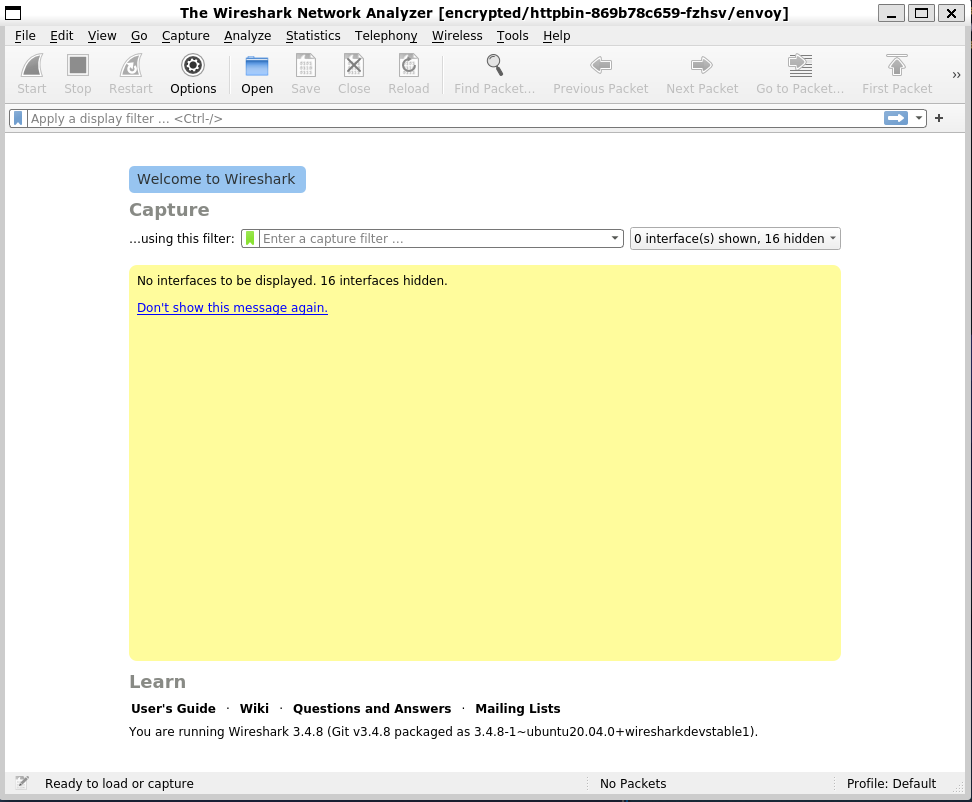
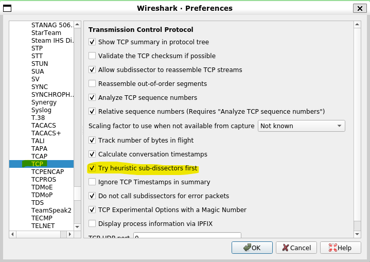
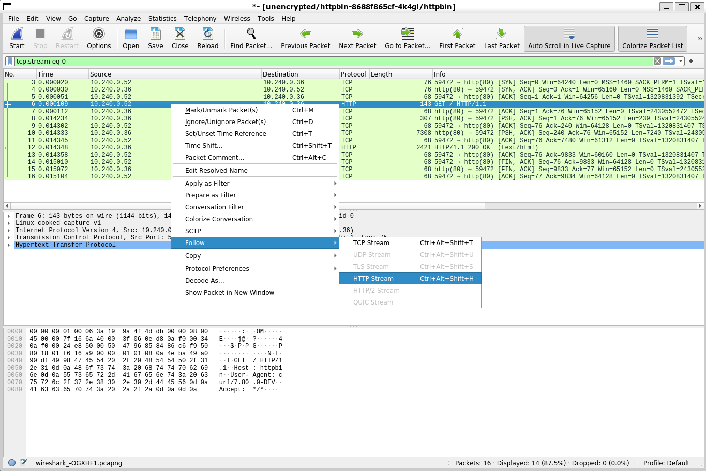
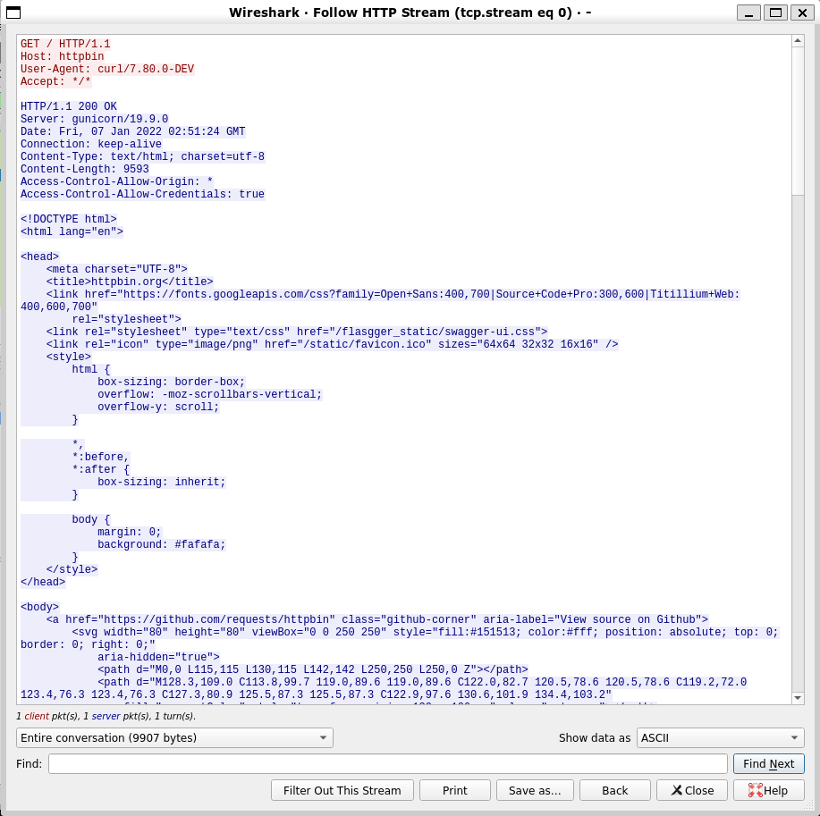
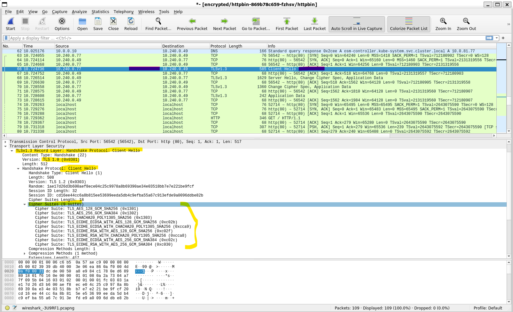
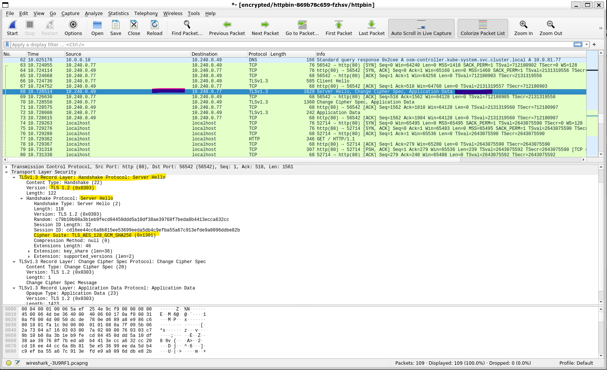
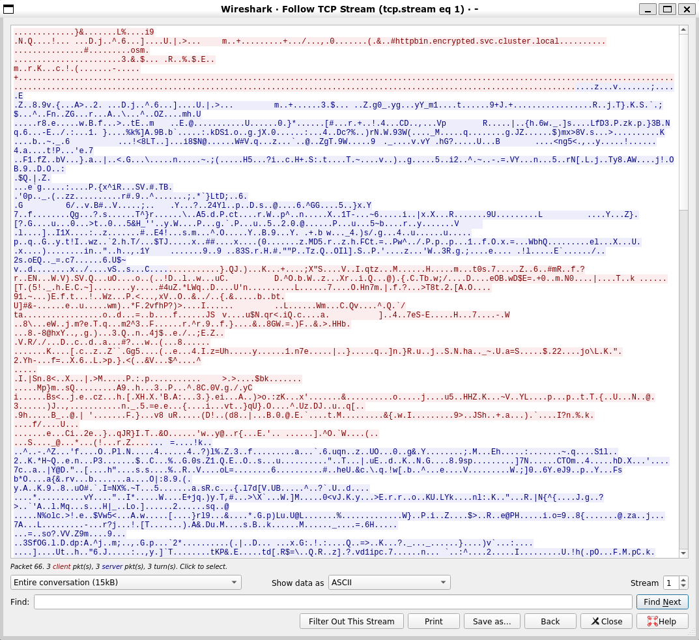
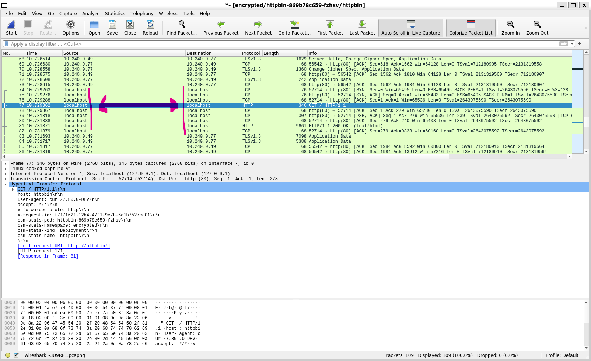

Open Service Mesh mTLS check
============================

Open Service Mesh enables automatic mTLS between services that are part of the service mesh.  However, how can you be sure mTLS is configured and actually working?

In this example we will use tcpdump and wireshark via the [ksniff](https://github.com/eldadru/ksniff) [krew](https://krew.sigs.k8s.io/) plugin for kubectl.

Prerequisities
--------------

* AKS cluster with [OSM add-on enabled](https://docs.microsoft.com/en-us/azure/aks/open-service-mesh-deploy-addon-az-cli#install-the-osm-aks-add-on-on-your-cluster) -- technically, you can use any Kubernetes cluster with self-install OSM
* [OSM CLI configured](https://docs.microsoft.com/en-us/azure/aks/open-service-mesh-binary?pivots=client-operating-system-linux#configure-osm-cli-variables-with-an-osm_config-file)
* Admin user access to the AKS cluster
* Wireshark in your path (e.g. on Ubuntu `sudo apt install wireshark`) -- install latest via PPA

```sh
sudo add-apt-repository ppa:wireshark-dev/stable
sudo apt update
sudo apt install wireshark
sudo dpkg-reconfigure wireshark-common
# Select 'Yes'
sudo dpkg-reconfigure wireshark-common
# Restart wsl2/ubuntu
wireshark --version
# Wireshark 3.4.8 (Git v3.4.8 packaged as 3.4.8-1~ubuntu20.04.0+wiresharkdevstable1)
wireshark
```



* yq

```sh
pip3 install yq
```

Notes
-----

* The local environment used for this demo is Windows 11 + WSL2 with Ubuntu 20.04 LTS -- but any similar setup should work with minor changes
* Wireshark will only detect HTTP protocol traffic on well-known ports like 80, 443 -- if you have HTTP services on other ports then [configure Wireshark HTTP preferences](https://wiki.wireshark.org/HTTP_Preferences) or enable Heuristic sub-dissectors (from the menu: **Edit** / **Preferences** / **Protocols** / **TCP** / **Try heuristic sub-dissectors first**)



* `tcmpdump` cannot be run in non-privileged or distroless/scratch containers: use [ksniff workaround](https://github.com/eldadru/ksniff#non-privileged-and-scratch-pods) with the `-p` flag
    * This would be the case with the `curl` and `envoy` containers but not the `httpbin` container
* We'll focus on the `httpbin` container (the server) but you can also check the `curl` container (the client) to examine traffic on the client side
* Attaching to either httpbin or envoy containers will work since they share the same network interface and we can sniff any traffic in the same pod

Demo app
--------

Credit: This demo app is taken from: https://github.com/openservicemesh/osm/tree/main/docs/example/manifests/samples

Deploy the app with and without envoy sidecars:

```sh
kubectl create namespace encrypted
kubectl label namespace encrypted openservicemesh.io/monitored-by=osm
kubectl create namespace unencrypted

kubectl apply -f httpbin/httpbin-sidecar.yaml -n encrypted
kubectl apply -f httpbin/httpbin.yaml -n unencrypted

kubectl apply -f curl/curl-sidecar.yaml -n encrypted
kubectl apply -f curl/curl.yaml -n unencrypted

kubectl get pod -n encrypted
kubectl get pod -n unencrypted

# Get references to the pods (these can change if you restart the pods)
CURL_POD="$(kubectl get pod -n unencrypted -l app=curl -o name | cut -f 2,2 -d '/')"
HTTPBIN_POD="$(kubectl get pod -n unencrypted -l app=httpbin -o name | cut -f 2,2 -d '/')"
CURL_ENC_POD="$(kubectl get pod -n encrypted -l app=curl -o name | cut -f 2,2 -d '/')"
HTTPBIN_ENC_POD="$(kubectl get pod -n encrypted -l app=httpbin -o name | cut -f 2,2 -d '/')"

# Check the pod IPs in the unencrypted namespace
kubectl get pod -n unencrypted -o wide

#NAME                       READY   STATUS    RESTARTS   AGE   IP            NODE                                NOMINATED NODE   READINESS GATES
#curl-548c575854-tlj4b      1/1     Running   0          26h   10.240.0.52   aks-nodepool1-38579899-vmss000001   <none>           <none>
#httpbin-8688f865cf-4k4gl   1/1     Running   0          26h   10.240.0.36   aks-nodepool1-38579899-vmss000001   <none>           <none>
```

Here we can see the `curl` pod IP is `10.240.0.52` and `httpbin` pod IP is `10.240.0.36`.  This will be useful later when using Wireshark to identify the source and dest pod.

```sh
# Check the pod IPs in the encrypted namespace
kubectl get pod -n encrypted -o wide
#NAME                       READY   STATUS    RESTARTS   AGE   IP            NODE                                NOMINATED NODE   READINESS GATES
#curl-74c4b77794-7n5cp      2/2     Running   0          28h   10.240.0.77   aks-nodepool1-38579899-vmss000002   <none>           <none>
#httpbin-869b78c659-fzhsv   2/2     Running   0          28h   10.240.0.49   aks-nodepool1-38579899-vmss000001   <none>           <none>
```

Here we can see the `curl` pod IP is `10.240.0.77` and `httpbin` pod IP is `10.240.0.49`.  This will be useful later when using Wireshark to identify the source and dest pod.


Tracing HTTP traffic in the unencrypted namespace
-------------------------------------------------

Start packet sniffing on `httpbin` service in the `unencrypted` namespace:

```sh
kubectl sniff $HTTPBIN_POD -c httpbin -n unencrypted
```

Make a HTTP request to `httpbin`:

```sh
kubectl exec -ti $CURL_POD -c curl -n unencrypted -- curl http://httpbin/
```

Press the "Stop" button to pause packet capture.

In Wireshark we can see the TCP handshake, HTTP request, response and TCP connection close.

If we follow the HTTP stream we can see the HTTP request and reponse:





Here we can see the request and responses are directly between the `curl` (`10.240.0.52`) and `httpbin` (`10.240.0.36`) pods with no sidecar proxies involved.  Traffic is in plaintext (HTTP) and is not encrypted.

Close the Wireshark window to exit ksniff.

Tracing HTTP traffic in the encrypted namespace
-----------------------------------------------

Start packet sniffing on `httpbin` service in the `encrypted` namespace:

```sh
kubectl sniff $HTTPBIN_ENC_POD -c httpbin -n encrypted
```

Make a request to httpbin:

```sh
kubectl exec -ti $CURL_ENC_POD -c curl -n encrypted -- curl http://httpbin/
```

Press the "Stop" button to pause packet capture.

In Wireshark we can see the TCP handshake, TLS client hello, server hello, change cipherspec, etc., encrypted request and response, and TCP connection close.

Here is the TLS handshake Client Hello message:



And the corresponding TLS handshake Server Hello message:



The selected chipher suite was `TLS_AES_128_GCM_SHA256 (0x1301)`.

Follow the TCP stream and you will see that the messages exchnaged are encrypted:




Since the protocol used is TLSv1.3, it is not straight-forward to decrypt the messages as it mandates [Perfect Forward Secrecy](https://en.wikipedia.org/wiki/Forward_secrecy) (PFS).  Previously, you could extract the RSA private keys (for the client and server envoy proxies).  With PFS, a unique session key is generated for each individual session.  This means that even if you have the private key you cannot decrypt conversations.  You would also need the individual session key (out of scope for this demo) but that will not allow you to decrypt previous converations.

For our purposes in this demo, we can be assured that the communications are encrypted between the services.

If we remove any applied filter in Wireshark, we can see the comms using the pod IP addresses and then we have a number of calls with source and destination IPs of `localhost`.  These `localhost` calls are from/to the `envoy` proxy.  Traffic from/to the `envoy` proxy is within the same pod and is unencrypted.

See the unencrypted HTTP calls between the `envoy` proxy and the `httpbin` container:



Cleanup
-------

```sh
kubectl delete ns encrypted
kubectl delete ns unencrypted
```

References
----------

* [Verifying Service Mesh TLS in Kubernetes, Using ksniff and Wireshark](https://blog.getambassador.io/verifying-service-mesh-tls-in-kubernetes-using-ksniff-and-wireshark-454b1e3f4dc9)
* [OSM ports](https://release-v0-11.docs.openservicemesh.io/docs/guides/app_onboarding/prereqs/#ports)
* [yq](https://kislyuk.github.io/yq/) - yq: Command-line YAML/XML/TOML processor
* [Decoding TLS v1.2 Protocol Handshake With Wireshark](https://www.thesecmaster.com/decoding-tls-v1-2-protocol-handshake-with-wireshark/)
